# 🤖 Gmail Labeling AI Agent (Built with n8n)

This project automates the process of labeling incoming emails in Gmail using an AI agent built on n8n. It intelligently classifies emails into predefined categories like **Sponsorship**, **Collaboration**, **Business Inquiries**, or **Others**, and applies labels to help users manage their inbox more efficiently.

---

## 🚀 What It Does

- Listens for new emails using the **Gmail Trigger** node
- Passes the email to an **AI Chat Model** for intelligent classification
- Based on the result, the AI routes emails to:
  - 📌 **Sponsorship**
  - 🤝 **Collaboration**
  - 🧠 **Business Inquiries**
  - 📦 **Others**
- Applies Gmail labels automatically to organize your inbox

---

## 🛠️ Tools Used

| Tool          | Purpose                           |
|---------------|-----------------------------------|
| `n8n`         | Workflow automation platform      |
| `Gmail API`   | Triggering and labeling emails    |
| `AI Chat Node`| Classifying email intent          |

---

## 🧠 Workflow Structure

```mermaid
graph TD
    A[Gmail Trigger] --> B[Labeling AI Agent]
    B --> C1[Sponsorship ➜ Gmail Label]
    B --> C2[Collaboration ➜ Gmail Label]
    B --> C3[Business Inquiries ➜ Gmail Label]
    B --> C4[Others ➜ Gmail Label]

```



---

## 📁 Included Files

| File / Folder     | Description                                              |
|-------------------|----------------------------------------------------------|
| `workflow.json`   | Ready-to-import n8n workflow file                        |
| `/assets/`        | Folder for screenshots or workflow diagrams (optional)  |
| `README.md`       | This documentation file                                  |

---

## 💡 Use Cases

- Automate inbox management for creators & influencers  
- Automatically triage incoming business requests  
- Route emails to different folders or teams based on intent  

---

## 🧪 How to Use This

1. Import `workflow.json` into your n8n instance  
2. Set up Gmail credentials in n8n using OAuth2  
3. Update label names or create custom Gmail labels if needed  
4. Activate the workflow  

---

## 📷 Screenshots


```markdown


